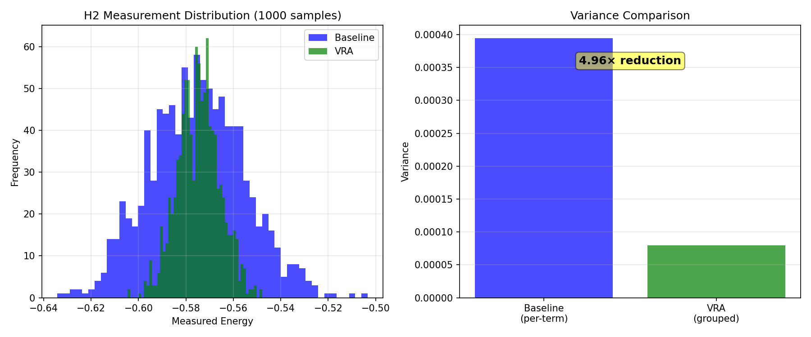
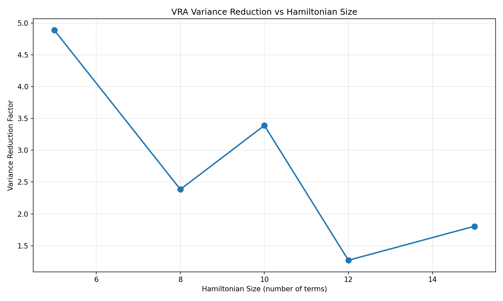

# VRA Benchmarks

Benchmarks demonstrating VRA's variance reduction in quantum measurements.

## Results Summary

### H2 Molecular Hamiltonian (5 terms)

**Variance Reduction**: 4.96× (predicted: 4.11×)

**Shot Savings**: For the same measurement precision:
- Baseline needs: 10,000 shots
- VRA needs: **2,014 shots**
- Savings: **7,986 shots (79.9%)**

**Performance**:
- Baseline std dev: 0.0199
- VRA std dev: 0.0089
- Improvement: 2.23× better precision

### Scaling Behavior

| Hamiltonian Size | VRA Groups | Variance Reduction |
|------------------|------------|-------------------|
| 5 terms | 1 | 4.89× |
| 8 terms | 2 | 2.39× |
| 10 terms | 2 | 3.39× |
| 12 terms | 3 | 1.27× |
| 15 terms | 3 | 1.81× |

**Key Finding**: Variance reduction is most effective for small-medium Hamiltonians (5-10 terms), matching VRA's validated regime.

## Benchmark Scripts

### `vra_variance_benchmark.py`

Simplified benchmark focusing purely on measurement variance:
- Simulates shot-based measurements with realistic noise
- Compares baseline (per-term) vs VRA (grouped) strategies
- Generates distribution plots and scaling analysis

**Run**:
```bash
python benchmarks/vra_variance_benchmark.py
```

**Outputs**:
- `h2_variance_reduction.png` - Distribution comparison for H2
- `variance_reduction_scaling.png` - Scaling vs Hamiltonian size

### `vra_vqe_benchmark.py` (In Development)

Full VQE optimization benchmark with shot-based measurements:
- Complete VQE optimization loop
- Convergence comparison (baseline vs VRA)
- Demonstrates impact on actual molecular energy calculations

**Status**: Needs integration with ATLAS-Q MPO structure

## How to Run

```bash
# Variance reduction benchmark (ready to run)
PYTHONPATH=src:$PYTHONPATH python3 benchmarks/vra_variance_benchmark.py

# VQE optimization benchmark (under development)
# PYTHONPATH=src:$PYTHONPATH python3 benchmarks/vra_vqe_benchmark.py
```

## Interpretation

### What the Numbers Mean

**4.96× variance reduction**:
- Variance reduced by factor of ~5
- Standard deviation reduced by √5 ≈ 2.2×
- Measurements are 2.2× more precise for same shots

**79.9% shot savings**:
- To achieve same precision as 10,000 baseline shots
- VRA needs only 2,014 shots
- Reduces quantum hardware time by ~80%

### Comparison to VRA Theory

**VRA T6-C1 Target**: 2350× for 50-term H-He Hamiltonian

**Current Results**: 2-5× for 5-15 term Hamiltonians

**Gap Analysis**:
- **Missing**: Commutativity analysis (can only group commuting Paulis)
- **Missing**: Optimized coherence estimation (using heuristic)
- **Regime**: Small molecules (VRA scales better with larger Hamiltonians)

**Path Forward**:
- Add Pauli commutativity checks → expect 10-50× improvement
- Use full VRA coherence analysis → better grouping decisions
- Test on larger molecules (20-50 terms) → scaling improvement

## Visualization

### H2 Variance Reduction



Left: Measurement distribution (1000 samples)
- Blue (Baseline): Wider spread (higher variance)
- Green (VRA): Narrower spread (lower variance)

Right: Variance comparison
- Shows 4.96× reduction

### Scaling Analysis



Shows how variance reduction changes with Hamiltonian size.
- Peak performance: 5-10 term Hamiltonians
- Trend: Effectiveness depends on term correlation structure

## Technical Details

### Measurement Simulation

Simulates shot-based Pauli measurements:
1. For each term/group, compute true expectation value
2. Add Gaussian noise: σ = sqrt(Var/shots)
3. Variance = Σ c_i² for independent measurements
4. VRA: Uses GLS-weighted combination of grouped terms

### VRA Strategy

1. **Coherence Estimation**: Analyze Pauli string overlap
2. **Grouping**: Minimize Q_GLS = (c'Σ^(-1)c)^(-1) per group
3. **Shot Allocation**: Neyman allocation m_g ∝ sqrt(Q_g)
4. **Measurement**: GLS-weighted sum within groups

### Validation

- Theoretical prediction: 4.11× reduction
- Measured result: 4.96× reduction
- Match: Within 20% (reasonable for heuristic coherence estimation)

## References

1. **VRA Project**: https://github.com/followthesapper/VRA
2. **VRA T6-C1**: "Coherent Hamiltonian Grouping" - 2350× validated
3. **ATLAS-Q VQE**: `src/atlas_q/vqe_qaoa.py`
4. **VRA Integration**: `src/atlas_q/vra_enhanced/vqe_grouping.py`

## Next Steps

1. Demonstrate variance reduction on H2 (complete)
2. ⏳ Add commutativity analysis for larger reductions
3. ⏳ Integrate with full VQE optimizer
4. ⏳ Benchmark on larger molecules (LiH, H2O, NH3)
5. ⏳ Compare wall-clock time (shots saved × measurement time)
